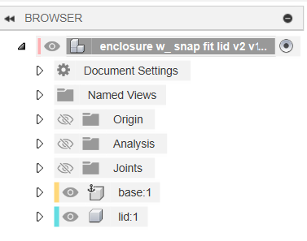
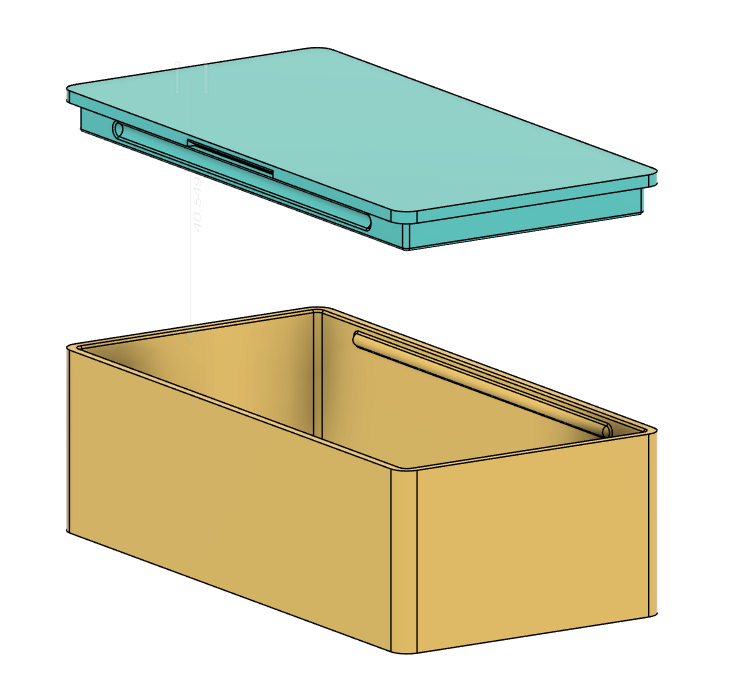
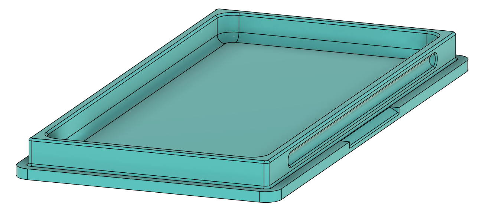
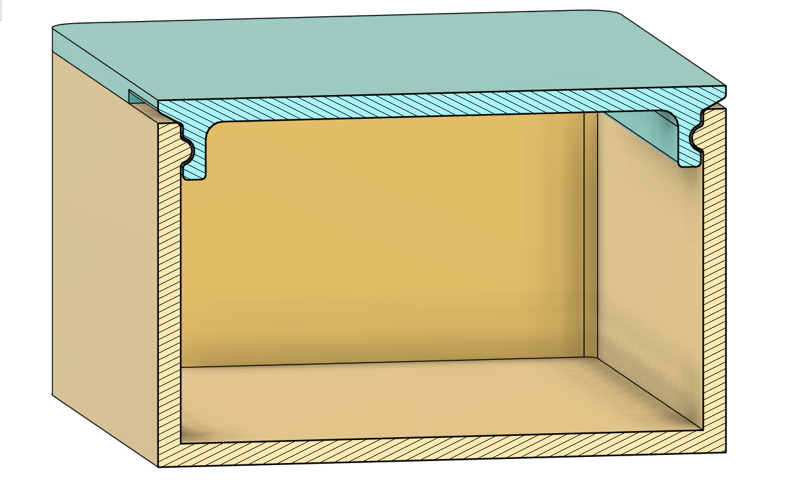
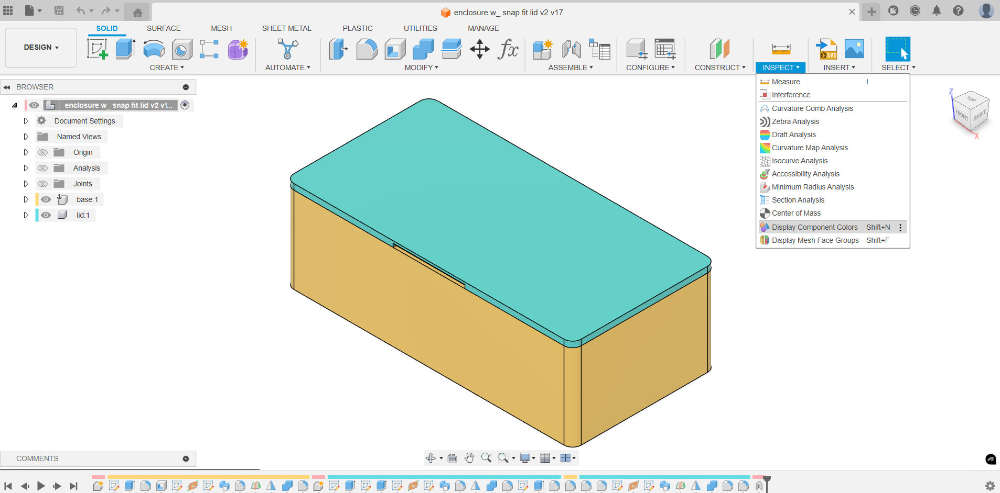
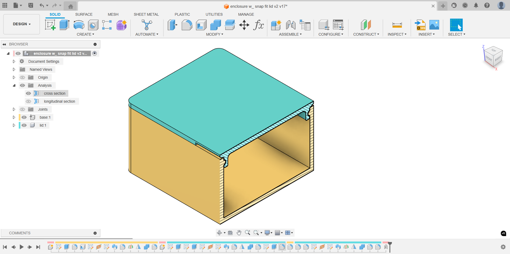
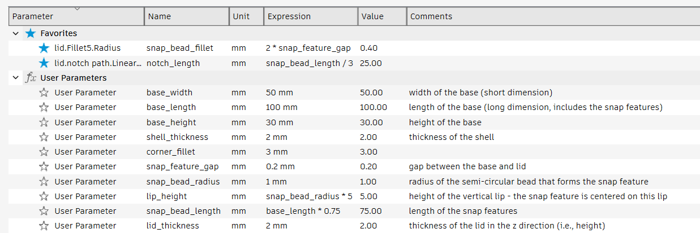
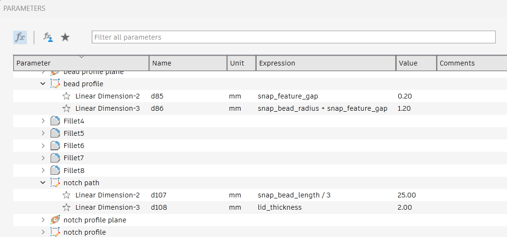
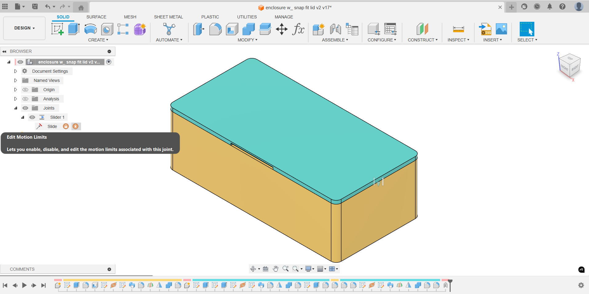

<h2>3D-Printed Enclosure w/ Snap-Fit Lid</h2>

<!--

-->

 

I created a **Autodesk Fusion** design for a generic, scalable enclosure with a snap-fit lid. The design is divided into two components: *base* and *lid*.

**Design Features:**

- fully parametric

- snap-fit joints on the two long sides

- uses the Sweep command to create semi-circular beads and corresponding recesses

- dimensions driven by the bead radius and the width of the gap between
the lid and the base

- beads and recesses are filleted with radius equal to twice the width of the gap

- notch on each side to facilitate lid removal

The *Display Component Colors* command found in the *Inspect* menu is extremely useful. Note that it also color codes the timeline entires, making it easier to locate the various features for editing.

The *Section Analysis* command found in the *Inspect* menu allows you to view cross sections through various construction planes. Once created, these will appear in the *Analysis* section of the *Browser*.

*User Parameters* can be defined/modified using the *Change Parameters* command found in the *Modify* menu. You can also designate *Favorites*.

The *Change Parameters* command can also be used to view/modify the various *Model Parameters* that are created as the design is edited.

The *Animate joint* command can be found by right-clicking on the selected joint in the *Joints* section in the browser. Here the motion limits can be defined.

